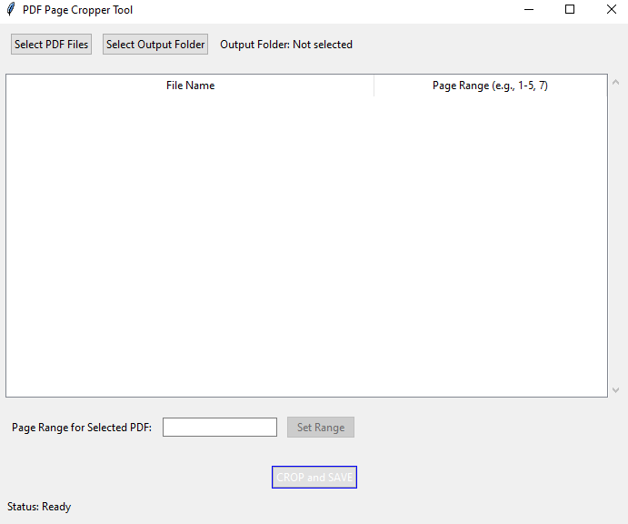

# PDF Page Cropper GUI

A simple and practical desktop application built with Python and Tkinter that allows users to extract specific page ranges from multiple PDF files and save them as new, smaller PDFs.

This project demonstrates the ability to create user-friendly utility tools that solve common document management problems, featuring an interactive list-based interface for batch processing.

---

### Application Interface

The application provides a clean and intuitive interface for managing multiple files. Users can load PDFs, see the total page count for each, and specify a custom page range before processing the entire batch.



---

### Core Functionality

*   **Interactive Batch Processing:** Uses a `ttk.Treeview` widget to display a list of files and their corresponding page ranges, allowing users to manage and configure multiple files at once.
*   **Dynamic Configuration:** Users can select any file from the list and update its specific page range on the fly before starting the main process.
*   **Robust Page Parsing:** Implements a parser to handle complex page range strings (e.g., "1-5, 8, 10-12"), converting them into a list of pages for extraction.
*   **Efficient PDF Manipulation:** Utilizes the `pypdf` library to read source documents and write new PDF files containing only the selected pages.
*   **Clean and Standard GUI:** Built with Python's native `tkinter` library and its modern `ttk` themed widgets for a clean, standard user experience.

### Technology Stack
*   **Python 3**
*   **Tkinter** (and `ttk`) for the GUI.
*   **pypdf** for core PDF reading and writing operations.

### Installation & Usage

**1. Clone the Repository & Install Python Libraries:**
```bash
# Clone this repository
git clone https://github.com/Unreliable-Support/pdf-page-cropper-gui.git

# Navigate to the project directory
cd pdf-page-cropper-gui

# Install required Python libraries
pip install -r requirements.txt